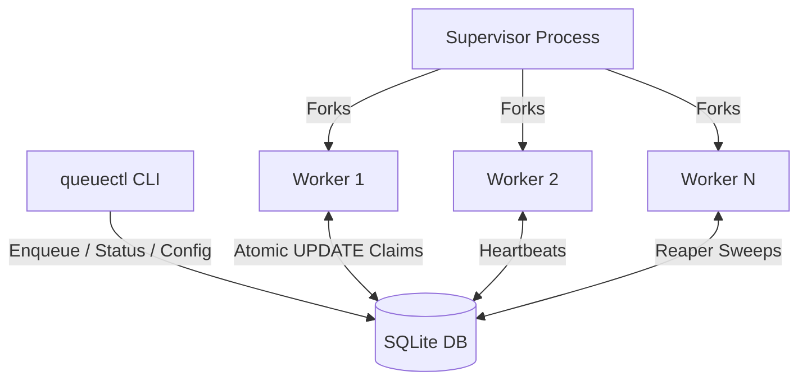

<div align="center">
  
# 🚀 QueueCTL
  
**A robust, CLI-based background job queue built for resilience.**

[](https://nodejs.org/)
[](https://sqlite.org/)
[](https://opensource.org/licenses/MIT)

*Features atomic job claiming, untrappable crash recovery, dead-letter-queue semantics, and a stunning real-time telemetry dashboard.*

---

### 🎥 [Watch the End-to-End Demo Recording Here](https://drive.google.com/file/d/1yI9bbdSxo2g1iS9coNRharyWE9AU3s-P/view?usp=sharing) 🎥

*(Demonstrates core usage, multi-worker concurrency, and untrappable `SIGKILL` crash recovery)*

</div>

---

## 🧠 Architecture Overview

At its core, QueueCTL leverages **SQLite in WAL (Write-Ahead Logging) mode** to allow concurrent reads and writes across multiple forked worker processes. 



### 🎯 Key Design Decisions

- **Atomic Claiming**: A single `UPDATE ... WHERE state='pending'` with a subquery guarantees that concurrent workers never claim the same job. No external locks needed.
- **Untrappable Crash Recovery**: Workers run a "Reaper" sweep every loop iteration. If a worker process is hard-killed (`kill -9`) mid-execution, its active jobs are recovered after a 20s heartbeat lease timeout.
- **Graceful Shutdown**: Workers intercept `SIGTERM` and `SIGINT`, finishing their currently executing job before exiting gracefully.

> 📖 *See [DECISIONS.md](DECISIONS.md) for the complete design rationale and deep-dive into the state machine mechanics.*

---

## 🛠️ Setup & Installation

**Prerequisites:** Linux/WSL2, Node.js (v22+), and build tools for SQLite.

```bash
# 1. Install dependencies
sudo apt update && sudo apt install -y build-essential python3

# 2. Clone and install
git clone <repo-url> && cd queuectl
npm install

# 3. Make globally executable (optional)
npm link
```
> ⚠️ **Note:** This project utilizes POSIX signal handling for graceful shutdowns (`SIGTERM`), which requires a Unix-like environment (Linux/Mac/WSL2).

---

## 💻 CLI Usage Guide

### ➕ Enqueue Jobs
```bash
# Basic job
node bin/queuectl.js enqueue '{"id":"job1","command":"echo Hello World"}'

# Custom retries and backoff
node bin/queuectl.js enqueue '{"id":"job2","command":"sleep 10","max_retries":5,"backoff_base":3}'
```

### 👷 Worker Management
```bash
# Start a supervisor with 3 parallel workers
node bin/queuectl.js worker start --count 3

# Safely signal workers to finish current jobs and stop (from another terminal)
node bin/queuectl.js worker stop
```

### 📊 Monitoring & Introspection
```bash
# View aggregated counts
node bin/queuectl.js status

# List jobs by state (human readable)
node bin/queuectl.js list --state pending

# Export machine-readable JSON for automation
node bin/queuectl.js list --state completed --json
```

### 💀 Dead Letter Queue (DLQ)
Jobs that fail all their retries are moved to the DLQ.
```bash
# List all dead jobs
node bin/queuectl.js dlq list

# Manually revive a job (resets attempts and moves back to pending)
node bin/queuectl.js dlq retry job1
```

---

## 🔄 Job Lifecycle & State Machine

```
pending ──► processing ──► completed
                 │
                 ▼
               failed ──► processing (after backoff delay)
                 │
                 ▼
                dead (DLQ, after max_retries exhausted)
```
* **Retry & Backoff**: Delays scale exponentially: `backoff_base ^ attempts` seconds. 

---

## 🧪 Automated Test Suite

A rigorous automated testing script verifies all constraints and edge cases.
```bash
node scripts/verify.js
```
**Scenarios Verified:**
1. Basic execution & completion.
2. Exponential backoff and DLQ transitions.
3. **Concurrency Exactly-Once**: 10 jobs across 3 workers execute with 0 duplicates.
4. **SIGKILL Recovery**: Validates the Reaper successfully reclaims a job from a hard-killed worker process.
5. Data persistence across process restarts.

---

## ✨ Premium Web Dashboard (Bonus Feature)

QueueCTL includes a real-time, glassmorphism-styled web telemetry dashboard!

```bash
node bin/queuectl.js dashboard
```
*Open `http://localhost:3000` in your browser.*

<div align="center">
  
  
</div>

- Features smooth micro-animations, glowing accent dropshadows, and a pulsing heartbeat indicator.
- Fully dynamic layout displaying aggregated job states and active worker PID badges.
- Automatically built with vanilla CSS (Zero external dependencies).
